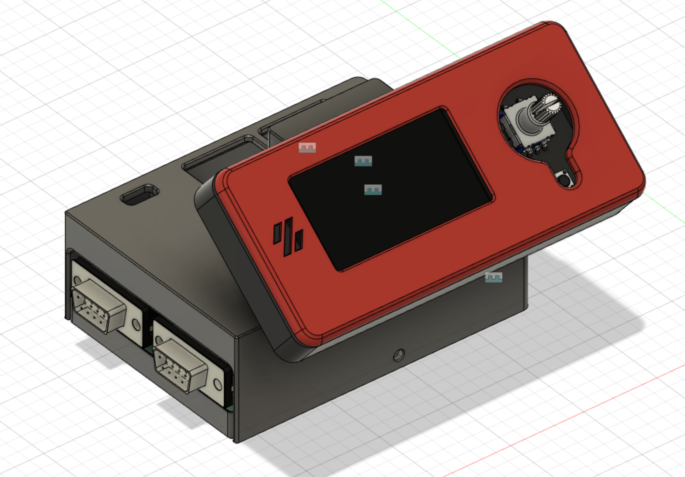

Raspberry Pi Pico Motor Expansion Board Exclosure
=======================================

A simple 3D printable enclosure and mount for 12864 display is supplied. 

The enclosure can be printed in any material. It is recommended to print in PLA, PETG or ABS. All parts shall be printed with 4 walls, 4 tops and 4 bottom layers. More than 20% infill is recommended. 

